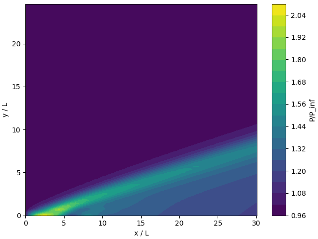

## Two Dimensional Complete Navier-Stokes equations

$$\frac{\partial \rho}{\partial t} + \frac{\partial \rho u}{\partial x} + \frac{\partial \rho v}{\partial y} = 0$$

$$\frac{\partial \rho u}{\partial t} + \frac{\partial}{\partial x}(\rho u^2 + p - \tau _{xx}) + \frac{\partial}{\partial y}(\rho uv - \tau _{xy}) = 0$$

$$\frac{\partial \rho v}{\partial t} + \frac{\partial}{\partial x}(\rho uv - \tau _{xy}) + \frac{\partial}{\partial y}(\rho v^2 + p - \tau _{yy}) = 0$$

$$\frac{\partial E_t}{\partial t} + \frac{\partial}{\partial x}((E_t + p)u + q_x - u\tau_{xx} - v\tau _{xy}) + \frac{\partial}{\partial y}((E_t + p)v + q_y - u\tau_{xy} - v\tau _{yy}) = 0$$

where $E_t$ is the sum of the kinetic energy and the internal energy $e$ per unit of volume

$$E_t = \rho (e + V^2/2)$$

The shear and normal stress are:

$$\tau_{xy} = \mu (\frac{\partial u}{\partial y} + \frac{\partial v}{\partial x})$$

$$\tau_{xx} = \lambda(\bigtriangledown  \cdot \bold V) + 2\mu \frac{\partial u}{\partial x}$$

$$\tau_{yy} = \lambda(\bigtriangledown  \cdot \bold V) + 2\mu \frac{\partial v}{\partial y}$$

where we can use $\lambda = -2/3\mu$.

The components of the heat flux vector (from Fourier's law of heat conduction):

$$q_x = -k\frac{\partial T}{\partial x}$$

$$q_y = -k\frac{\partial T}{\partial y}$$

We have described four equations and we have 8 unknown variables: $\rho$, $uç$, $v$, $p$, $T$, $e$, $\mu$, $k$.So we need to define four additional equations:

If we assume a perfect gas

$$p = \rho RT$$

If we assume the gas to be calorically perfect

$$e = c_v T$$

To calculate the viscosity we can use Sutherland's law:

$$\mu = \mu_0(\frac{T}{T_0})^{3/2}\frac{T_0+110}{T+110}$$

And for the final equation, we can assume that the Prandtl number is constant and approximately equal to 0.71

$$Pr = 0.71 = \frac{\mu c_p}{k}$$

## Alternate form of Navier-Stokes equations

$$\frac{\partial U}{\partial t} + \frac{\partial E}{\partial x} + \frac{\partial F}{\partial y} = 0 $$

where U, E, F are vectors given by

$$
\begin{aligned}
U &= \begin{Bmatrix}
 \rho\\ 
 \rho u\\ 
 \rho v\\ 
  E_t\\ 
 \end{Bmatrix} \\
 E &= \begin{Bmatrix}
 \rho u\\ 
 \rho u^2 + p - \tau_{xx}\\ 
 \rho uv - \tau_{xy}\\ 
  (E_t + p)u - u\tau_{xx} - v\tau_{xy} + q_x\\ 
 \end{Bmatrix} \\
 F &= \begin{Bmatrix}
 \rho v\\ 
 \rho uv - \tau_{xy}\\ 
 \rho v^2 + p - \tau_{yy}\\ 
  (E_t + p)v - u\tau_{xy} - v\tau_{yy} + q_y\\ 
 \end{Bmatrix}
 \end{aligned}
$$

## Problem

I have created a class that contains all the data specific to this problem, so later I can reuse code for other configurations. So let's call the class SupersonicFlatPlate.

The first step is to initialize the relevant parameters:

$$M_\infty = 4$$
$$Plate Length = 0.00001m$$
$$a_\infty = 340.28m/s$$
$$P_\infty = 10132503N/m^2$$
$$T_\infty = 288.16K$$
$$T_{wall}/T_\infty = 1$$
$$\gamma = 0.4$$
$$P_r = 0.71$$
$$\mu_0 = 1.7894\cdot 10^{-5}kg/{(m\cdot s)}$$
$$T_0 = 288.16K$$
$$R = 287J/{(Kg\cdot K)}$$

The plate length is so small to make the solution converge faster, and to reduce the size of the mesh.

## Calculation of Step Sizes in Space

The first thing we need to do is define the grid size in the streamwise direction. I´m going to use a grid of 100 x 100. With this we can calculate the step size in the x direction as:

$$IMAX=100$$
$$\Delta  x = \frac{LengthPlate}{IMAX}$$

For the y direction we also have 100 grids, but we need to guess the size of the domain. For this, we can assume it is going to be five times the size of the boundary layer, as predicted by the Blasius equation, using the Reynolds number.

$$L_{vert} = 5 \cdot \delta$$
$$\delta = \frac{5 \cdot LengthPlate}{\sqrt{R_e}}$$
$$R_e = \rho u LengthPlate / \mu$$

from which we can calculate the step size in the y drection as:

$$\Delta  x = \frac{L_{vert}}{JMAX}$$

We could verify these step size by calculating the Reynolds numbers and set some appropiate values. The requirements in the y direction should be stricter than in the y direction, because it has stronger gradients.

## Step Size in Time
To calculate the step size, we are going to use the Courant-Friedrichs-Lewy (CFL) criterion, which it can be defined as follows:

$$(\Delta t_{CFL})_{i,j} = [\frac{|u_{i,j}}{\Delta x} + \frac{|v_{i,j}}{\Delta y} + a_{i,j}\sqrt{\frac{1}{\Delta x^2} + \frac{1}{\Delta y^2}} + 2v'_{i,j}(\frac{1}{\Delta x^2} + \frac{1}{\Delta y^2})]^{-1}$$

where

$$v'_{i,j} = abs[\frac{4/3\mu_{i,j}(\gamma \mu_{i,j}/P_r)}{\rho_{i,j}}]$$

Then

$$\Delta t = min[K(\Delta t_{CFL})_{i,j}]$$

and K is the Courant factor that acts as a "fudge factor" to make sure the solutin remains stable.

### Viscosity
To calculate the viscosity, assuming perfect gas, we are going to use Sutherland's law.

$$\mu=\mu_0*(\frac{T}{T_o})^{3/2}\frac{T_0+110}{T+110}$$

## Initial Condition

We can set the intial condition equal to the freestream flow except over the plate, where we set the the wall Temperature and a no-slip condition

$$u = v = 0.0$$

The pressure will be calculated by extrapolating the pressure near the edge:

$$P(i,0) = 2P(i, 1) - P(i, 2)$$

## Boundary Conditions

Having specified the inital conditions, we need to enforce boundary conditions.

### (0,0)
In the leading edge, which is the point (0, 0), we enforce the no-slip condition, and the temperatur and pressure are asumed to take the freestream conditions.

### Left and Upper Boundary
In the left and upper boundary, the flow is assumed to take the freestream conditions, and the y component of the velocity is assumed to be equal to zero.

### Surface of the Plate
In the surface of the plate, we add a the no-slip condition, a temperature equal to the wall temperature and we extrapolate the pressure, in the same way as we have done for the initial conditions.

$$u = v = 0.0$$
$$T = T_{wall}$$
$$P(i,0) = 2P(i, 1) - P(i, 2)$$

### Right Side
All properties in the right side are calculated by extrapolation of interior points. For example, the velocity u is:

$$u(imax, j) = 2u(imax - 1, j) - u(imax - 2, j)$$

## MacCormack Solver

The MacCormack solver is a time-marching technique in two spatial dimensions. To use the MacCormack technique we need to write the Navier-Stokes equations in the form:

$$\frac{\partial U}{\partial t} + \frac{\partial E}{\partial x} + \frac{\partial F}{\partial y} = 0 $$

as we have seen earlier.

This technique is also called the predictor-corrector scheme, because it consists of two steps, one denoted predictor which is:

$$\overline{U}^{t+\Delta t}_{i,j}={U}^{t}_{i,j} - \frac{\Delta t}{\Delta x}(E^t _{i+1,j} - E^t _{i,j}) - \frac{\Delta t}{\Delta y}(F^t _{i,j+1} - F^t _{i,j})$$

And a second corrector step, which uses the predicted values mentioned before:

$${U}^{t+\Delta t}_{i,j} = \frac{1}{2}[{U}^{t}_{i,j} + \overline{U}^{t+\Delta t}_{i,j} - \frac{\Delta t}{\Delta x}(\overline{E}^t _{i,j} - \overline{E}^t _{i-1,j}) - \frac{\Delta t}{\Delta y}(\overline{F}^t _{i,j} - \overline{F}^t _{i,j-1})]$$

In the predictor step, the differences in E can be thought as forward differences in x, and likewise in F with respect to y. To mantain the second-order derivatives accuracy, we need to do the derivatives inside E and F in the opposite direction. For example, in the predictor step, in E the derivatives in x will be rearward differences, and in y will be central differences.


"[markdown]": {
    "editor.tabSize": 2
  }

```cpp
void SupersonicFlatPlate::Run() {

    // Sets initial conditions.
    InitializeFlowFliedVariables();

    for (int it = 0; it < maxit; it++) {

        std::cout << "Iteration " << it << std::endl;

        double delta_t = CalcTStep(imax_, jmax_, deltax_, deltay_, flow_parameters_, u_, v_, rho_, P_, T_, 0.6);

        rho_old_ = rho_;

        maccormack_solver_.UpdatePredictor(delta_t, deltax_, deltay_, imax_, jmax_, flow_parameters_, u_, v_, rho_, P_, T_, e_);

        BoundaryConditions(imax_, jmax_, flow_parameters_, u_, v_, rho_, P_, T_, e_);

        maccormack_solver_.UpdateCorrector(delta_t, deltax_, deltay_, imax_, jmax_, flow_parameters_, u_, v_, rho_, P_, T_, e_);

        BoundaryConditions(imax_, jmax_, flow_parameters_, u_, v_, rho_, P_, T_, e_);

        double diff = 0.0;
        if (CheckConvergence(diff)) {
            break;
        }
    }
}
```

This is the main loop of the program, the first line sets the initial conditions of the flow. As we have seen, this sets the flow variables to the freestream conditions, except on the plate, where we set the boundary conditions.

```cpp
void SupersonicFlatPlate::InitializeFlowFliedVariables() {

    for (int i = 0; i < imax_; i++) {
        for (int j = 0; j < jmax_; j++) {
            T_.Get(i, j) = flow_parameters_.T_inf;
            P_.Get(i, j) = flow_parameters_.P_inf;
            rho_.Get(i, j) = flow_parameters_.P_inf / flow_parameters_.T_inf / flow_parameters_.R;
            u_.Get(i, j) = flow_parameters_.M_inf * flow_parameters_.a_inf;
            v_.Get(i, j) = 0;
            M_.Get(i, j) = flow_parameters_.M_inf;
            e_.Get(i, j) = flow_parameters_.cv * flow_parameters_.T_inf;
        }
    }

    // Wall conditions
    for (int i = 1; i < imax_; i++) {
        T_.Get(i, 0) = flow_parameters_.T_wall;
        u_.Get(i, 0) = 0;
        v_.Get(i, 0) = 0;
        M_.Get(i, 0) = 0;
        rho_.Get(i, 0) = flow_parameters_.P_inf / T_.Get(i, 0) / flow_parameters_.R;
        e_.Get(i, 0) = flow_parameters_.cv * flow_parameters_.T_wall;
    }

    // Leading edge conditions
    u_.Get(0, 0) = 0;
    v_.Get(0, 0) = 0;
    M_.Get(0, 0) = 0;

}
```

Then we have the loop over all iterations. We have set a maximum number of iterations, but we will get out of the loop by checking if the solution has converged.

The first step, we need to calculate the time step.

```cpp
double CalcTStep(int imax, int jmax, double deltax, double deltay,
    const FlowParameters& params, const Array2D<double>& u, const Array2D<double>& v,
    const Array2D<double>& rho, const Array2D<double>& P, const Array2D<double>& T, double K) {

    double delta_t = 1.0;

    for (int i = 0; i < imax; i++) {
        for (int j = 0; j < jmax; j++) {

            double u_ij = u.Get(i, j);
            double v_ij = v.Get(i, j);

            double delta_t_ij = abs(u_ij) / deltax;
            delta_t_ij += abs(v_ij) / deltay;

            double a_ij = sqrt(std::max(0.0, P.Get(i, j)*params.gamma / rho.Get(i, j)));
            delta_t_ij += a_ij * sqrt(1. / deltax / deltax + 1. / deltay / deltay);

            double mu_ij = ViscositySutherlandLaw(params, T.Get(i, j));
            double vv_ij = abs(4. / 3.*mu_ij*(params.gamma*mu_ij / params.Pr) / rho.Get(i, j));
            delta_t_ij += 2 * vv_ij*(1. / deltax / deltax + 1. / deltay / deltay);

            delta_t_ij = 1.0 / delta_t_ij;

            delta_t = std::min(delta_t, delta_t_ij*K);
        }
    }

    return delta_t;
}
```

And then we have the main algorithm, which uses the MacCormack technique, which is divided on the predictor step and corrector step. Our implementation for the corrector step expects that the predictor step has been run before.

```cpp
void MacCormack::UpdatePredictor(double delta_t, double delta_x, double delta_y, int imax, int jmax, const FlowParameters& params,
    Array2D<double>& u, Array2D<double>& v, Array2D<double>& rho, Array2D<double>& P,
    Array2D<double>& T, Array2D<double>& e) {

    EncodeState(imax, jmax, params, u, v, rho, P, T, e);

    CalcE(imax, jmax, delta_x, delta_y, params, u, v, rho, P, T, e, REARWARDS_DIFFERENCES, CENTRAL_DIFFERENCES);
    CalcF(imax, jmax, delta_x, delta_y, params, u, v, rho, P, T, e, CENTRAL_DIFFERENCES, REARWARDS_DIFFERENCES);

    for (int i = 1; i < imax - 1; i++) {
        for (int j = 1; j < jmax - 1; j++) {
            for (int k = 0; k < 4; k++) {
                double x = E_[k].Get(i, j);
                double y = E_[k].Get(i + 1, j);
                double xx = F_[k].Get(i, j);
                double yy = F_[k].Get(i, j + 1);
                double a = E_[k].Get(i + 1, j) - E_[k].Get(i, j);
                double b = F_[k].Get(i, j + 1) - F_[k].Get(i, j);
                double tmp = -delta_t / delta_x * (E_[k].Get(i + 1, j) - E_[k].Get(i, j))
                    - delta_t / delta_y * (F_[k].Get(i, j + 1) - F_[k].Get(i, j));
                double tmp3 = U_predicted_[k].Get(i, j) + tmp;
                U_predicted_[k].Set(i, j, U_[k].Get(i, j) - delta_t / delta_x * (E_[k].Get(i + 1, j) - E_[k].Get(i, j))
                    - delta_t / delta_y * (F_[k].Get(i, j + 1) - F_[k].Get(i, j)));
            }
        }
    }

    DecodeState(imax, jmax, params, u, v, rho, P, T, e, U_predicted_);
}

void MacCormack::UpdateCorrector(double delta_t, double delta_x, double delta_y, int imax, int jmax, const FlowParameters& params,
    Array2D<double>& u, Array2D<double>& v, Array2D<double>& rho, Array2D<double>& P,
    Array2D<double>& T, Array2D<double>& e) {

    for (int i = 1; i < imax - 1; i++) {
        for (int j = 1; j < jmax - 1; j++) {
            for (int k = 0; k < 4; k++) {
                U_corrected_[k].Set(i, j, U_[k].Get(i, j));
            }
        }
    }

    EncodeState(imax, jmax, params, u, v, rho, P, T, e);

    CalcE(imax, jmax, delta_x, delta_y, params, u, v, rho, P, T, e, FORWARD_DIFFERENCES, CENTRAL_DIFFERENCES);
    CalcF(imax, jmax, delta_x, delta_y, params, u, v, rho, P, T, e, CENTRAL_DIFFERENCES, FORWARD_DIFFERENCES);

    for (int i = 1; i < imax - 1; i++) {
        for (int j = 1; j < jmax - 1; j++) {
            for (int k = 0; k < 4; k++) {
                double x = E_[k].Get(i, j);
                double y = E_[k].Get(i - 1, j);
                double xx = F_[k].Get(i, j);
                double yy = F_[k].Get(i, j - 1);
                double a = E_[k].Get(i, j) - E_[k].Get(i - 1, j);
                double b = F_[k].Get(i, j) - F_[k].Get(i, j - 1);
                double tmp = -delta_t / delta_x * (E_[k].Get(i, j) - E_[k].Get(i - 1, j))
                    - delta_t / delta_y * (F_[k].Get(i, j) - F_[k].Get(i, j - 1));
                double tmp2 = U_corrected_[k].Get(i, j);
                double tmp3 = U_predicted_[k].Get(i, j) + tmp;
                U_corrected_[k].Set(i, j, 0.5*(U_corrected_[k].Get(i, j) + U_predicted_[k].Get(i, j) - delta_t / delta_x * (E_[k].Get(i, j) - E_[k].Get(i - 1, j))
                    - delta_t / delta_y * (F_[k].Get(i, j) - F_[k].Get(i, j - 1))));
            }
        }
    }

    DecodeState(imax, jmax, params, u, v, rho, P, T, e, U_corrected_);
}
```
We can see that we have defined to functions to transform the flow variable to the vector that uses the differential equations.

```cpp
void MacCormack::EncodeState(int imax, int jmax, const FlowParameters& params,
    Array2D<double>& u, Array2D<double>& v, Array2D<double>& rho, Array2D<double>& P,
    Array2D<double>& T, Array2D<double>& e) {

    double rho_ij;
    double u_ij;
    double v_ij;

    for (int i = 0; i < imax; i++) {
        for (int j = 0; j < jmax; j++) {

            rho_ij = rho.Get(i, j);
            u_ij = u.Get(i, j);
            v_ij = v.Get(i, j);

            U_[0].Set(i, j, rho_ij);
            U_[1].Set(i, j, rho_ij*u_ij);
            U_[2].Set(i, j, rho_ij*v_ij);
            U_[3].Set(i, j, rho_ij*(e.Get(i, j) + (u_ij*u_ij + v_ij * v_ij) / 2.));
        }
    }

}

void MacCormack::DecodeState(int imax, int jmax, const FlowParameters& params,
    Array2D<double>& u, Array2D<double>& v, Array2D<double>& rho, Array2D<double>& P,
    Array2D<double>& T, Array2D<double>& e, Array2D<double>(&U)[4]) {

    double rho_ij;
    double u_ij;
    double v_ij;
    double e_ij;

    for (int i = 1; i < imax - 1; i++) {
        for (int j = 1; j < jmax - 1; j++) {

            rho_ij = U[0].Get(i, j);
            u_ij = U[1].Get(i, j) / U[0].Get(i, j);
            v_ij = U[2].Get(i, j) / U[0].Get(i, j);
            e_ij = U[3].Get(i, j) / rho_ij - (u_ij*u_ij + v_ij * v_ij) / 2.0;

            u.Set(i, j, u_ij);
            v.Set(i, j, v_ij);
            rho.Set(i, j, rho_ij);
            T.Set(i, j, e_ij / params.cv);
            e.Set(i, j, e_ij);
            P.Set(i, j, params.R*rho_ij*T.Get(i, j));
        }
    }

}
```

Then we need to implement the functions E and F defined earlier.

```cpp
void MacCormack::CalcE(int imax, int jmax, double deltax, double deltay, const FlowParameters& params,
    Array2D<double>& u, Array2D<double>& v, Array2D<double>& rho, Array2D<double>& P,
    Array2D<double>& T, Array2D<double>& e, FiniteDifferencesType type_differences_x, FiniteDifferencesType type_differences_y) {

    double rho_ij;
    double u_ij;
    double v_ij;
    double p_ij;
    double tau_xx;
    double tau_xy;
    double q_x;

    CalcStress(imax, jmax, deltax, deltay, params, u, v, T, type_differences_x, type_differences_y);
    CalcHeatFlux(imax, jmax, deltax, deltay, params, T, type_differences_x, type_differences_y);

    for (int i = 0; i < imax; i++) {
        for (int j = 0; j < jmax; j++) {

            rho_ij = rho.Get(i, j);
            u_ij = u.Get(i, j);
            v_ij = v.Get(i, j);
            p_ij = P.Get(i, j);
            tau_xx = tauxx_.Get(i, j);
            tau_xy = tauxy_.Get(i, j);
            q_x = qx_.Get(i, j);

            E_[0].Set(i, j, rho_ij*u_ij);
            E_[1].Set(i, j, rho_ij*u_ij*u_ij + p_ij - tau_xx);
            E_[2].Set(i, j, rho_ij*u_ij*v_ij - tau_xy);
            E_[3].Set(i, j, (U_[3].Get(i, j) + p_ij)*u_ij - u_ij * tau_xx - v_ij * tau_xy + q_x);
        }
    }

}

void MacCormack::CalcF(int imax, int jmax, double deltax, double deltay, const FlowParameters& params,
    Array2D<double>& u, Array2D<double>& v, Array2D<double>& rho, Array2D<double>& P,
    Array2D<double>& T, Array2D<double>& e, FiniteDifferencesType type_differences_x, FiniteDifferencesType type_differences_y) {

    double rho_ij;
    double u_ij;
    double v_ij;
    double p_ij;
    double tau_yy;
    double tau_xy;
    double q_y;

    CalcStress(imax, jmax, deltax, deltay, params, u, v, T, type_differences_x, type_differences_y);
    CalcHeatFlux(imax, jmax, deltax, deltay, params, T, type_differences_x, type_differences_y);

    for (int i = 0; i < imax; i++) {
        for (int j = 0; j < jmax; j++) {

            rho_ij = rho.Get(i, j);
            u_ij = u.Get(i, j);
            v_ij = v.Get(i, j);
            p_ij = P.Get(i, j);
            tau_yy = tauyy_.Get(i, j);
            tau_xy = tauxy_.Get(i, j);
            q_y = qy_.Get(i, j);

            F_[0].Set(i, j, rho_ij*v_ij);
            F_[1].Set(i, j, rho_ij*u_ij*v_ij - tau_xy);
            F_[2].Set(i, j, rho_ij*v_ij*v_ij + p_ij - tau_yy);
            F_[3].Set(i, j, (U_[3].Get(i, j) + p_ij)*v_ij - u_ij * tau_xy - v_ij * tau_yy + q_y);
        }
    }

}

void MacCormack::CalcStress(int imax, int jmax, double deltax, double deltay, const FlowParameters& params,
    Array2D<double>& u, Array2D<double>& v, Array2D<double>& T,
    FiniteDifferencesType type_differences_x, FiniteDifferencesType type_differences_y) {

    double u_ij;
    double v_ij;
    double t_ij;
    double ux_ij;
    double uy_ij;
    double vx_ij;
    double vy_ij;
    double mu_ij;

    for (int i = 0; i < imax; i++) {
        for (int j = 0; j < jmax; j++) {

            u_ij = u.Get(i, j);
            v_ij = v.Get(i, j);
            t_ij = T.Get(i, j);
            mu_ij = ViscositySutherlandLaw(params, T.Get(i, j));

            if (i == 0) {
                ux_ij = (u.Get(i + 1, j) - u_ij) / deltax;
                vx_ij = (v.Get(i + 1, j) - v_ij) / deltax;
            }
            else if (i == imax - 1) {
                ux_ij = (u_ij - u.Get(i - 1, j)) / deltax;
                vx_ij = (v_ij - v.Get(i - 1, j)) / deltax;
            }
            else {
                switch (type_differences_x) {
                case FORWARD_DIFFERENCES:
                    ux_ij = (u.Get(i + 1, j) - u_ij) / deltax;
                    vx_ij = (v.Get(i + 1, j) - v_ij) / deltax;
                    break;
                case CENTRAL_DIFFERENCES:
                    ux_ij = (u.Get(i + 1, j) - u.Get(i - 1, j)) / (2 * deltax);
                    vx_ij = (v.Get(i + 1, j) - v.Get(i - 1, j)) / (2 * deltax);
                    break;
                case REARWARDS_DIFFERENCES:
                    ux_ij = (u_ij - u.Get(i - 1, j)) / deltax;
                    vx_ij = (v_ij - v.Get(i - 1, j)) / deltax;
                    break;
                }
            }

            if (j == 0) {
                uy_ij = (u.Get(i, j + 1) - u_ij) / deltay;
                vy_ij = (v.Get(i, j + 1) - v_ij) / deltay;
            }
            else if (j == jmax - 1) {
                uy_ij = (u_ij - u.Get(i, j - 1)) / deltay;
                vy_ij = (v_ij - v.Get(i, j - 1)) / deltay;
            }
            else {
                switch (type_differences_y) {
                case FORWARD_DIFFERENCES:
                    uy_ij = (u.Get(i, j + 1) - u_ij) / deltay;
                    vy_ij = (v.Get(i, j + 1) - v_ij) / deltay;
                    break;
                case CENTRAL_DIFFERENCES:
                    uy_ij = (u.Get(i, j + 1) - u.Get(i, j - 1)) / (2 * deltay);
                    vy_ij = (v.Get(i, j + 1) - v.Get(i, j - 1)) / (2 * deltay);
                    break;
                case REARWARDS_DIFFERENCES:
                    uy_ij = (u_ij - u.Get(i, j - 1)) / deltay;
                    vy_ij = (v_ij - v.Get(i, j - 1)) / deltay;
                    break;
                }
            }

            tauxx_.Set(i, j, -2. / 3 * mu_ij * (ux_ij + vy_ij) + 2 * mu_ij * ux_ij);
            tauyy_.Set(i, j, -2. / 3 * mu_ij * (ux_ij + vy_ij) + 2 * mu_ij * vy_ij);
            tauxy_.Set(i, j, mu_ij * (uy_ij + vx_ij));
        }
    }

}

void MacCormack::CalcHeatFlux(int imax, int jmax, double deltax, double deltay, const FlowParameters& params,
    Array2D<double>& T, FiniteDifferencesType type_differences_x, FiniteDifferencesType type_differences_y) {

    double t_ij;
    double tx_ij;
    double ty_ij;
    double mu_ij;
    double k_ij;

    for (int i = 0; i < imax; i++) {
        for (int j = 0; j < jmax; j++) {

            t_ij = T.Get(i, j);

            if (i == 0) {
                tx_ij = (T.Get(i + 1, j) - t_ij) / deltax;
            }
            else if (i == imax - 1) {
                tx_ij = (t_ij - T.Get(i - 1, j)) / deltax;
            }
            else {
                switch (type_differences_x) {
                case FORWARD_DIFFERENCES:
                    tx_ij = (T.Get(i + 1, j) - t_ij) / deltax;
                    break;
                case CENTRAL_DIFFERENCES:
                    tx_ij = (T.Get(i + 1, j) - T.Get(i - 1, j)) / (2 * deltax);
                    break;
                case REARWARDS_DIFFERENCES:
                    tx_ij = (t_ij - T.Get(i - 1, j)) / deltax;
                    break;
                }
            }

            if (j == 0) {
                ty_ij = (T.Get(i, j + 1) - t_ij) / deltay;
            }
            else if (j == jmax - 1) {
                ty_ij = (t_ij - T.Get(i, j - 1)) / deltay;
            }
            else {
                switch (type_differences_y) {
                case FORWARD_DIFFERENCES:
                    ty_ij = (T.Get(i, j + 1) - t_ij) / deltay;
                    break;
                case CENTRAL_DIFFERENCES:
                    ty_ij = (T.Get(i, j + 1) - T.Get(i, j - 1)) / (2 * deltay);
                    break;
                case REARWARDS_DIFFERENCES:
                    ty_ij = (t_ij - T.Get(i, j - 1)) / deltay;
                    break;
                }
            }

            mu_ij = ViscositySutherlandLaw(params, T.Get(i, j));
            k_ij = mu_ij * params.cp / params.Pr;

            qx_.Set(i, j, -k_ij * tx_ij);
            qy_.Set(i, j, -k_ij * ty_ij);
        }
    }
}

double ViscositySutherlandLaw(const FlowParameters& params, double T) {
    return params.mu*pow(std::max(0.0, T / params.T_0), 1.5)*(params.T_0 + 110) / (T + 110);
}
```

We need to be careful when we are calculating the derivatives, because as we have explained earlier, the differences need to happen in the direction opposite as the derivatives in the predictor and corrector steps.

After each each we need to set the boundary conditions.

```cpp
void SupersonicFlatPlate::BoundaryConditions(int imax, int jmax, const FlowParameters& params,
    Array2D<double>& u, Array2D<double>& v, Array2D<double>& rho, Array2D<double>& P,
    Array2D<double>& T, Array2D<double>& e) {

    u.Set(0, 0, 0);
    v.Set(0, 0, 0);
    P.Set(0, 0, params.P_inf);
    T.Set(0, 0, params.T_inf);
    rho.Set(0, 0, params.P_inf / params.R / params.T_inf);
    e.Set(0, 0, params.T_inf*params.cv);

    for (int j = 1; j < jmax; j++) {
        u.Set(0, j, params.a_inf*params.M_inf);
        v.Set(0, j, 0);
        P.Set(0, j, params.P_inf);
        T.Set(0, j, params.T_inf);
        rho.Set(0, j, params.P_inf / params.R / params.T_inf);
        e.Set(0, j, params.T_inf*params.cv);
    }

    for (int i = 0; i < imax; i++) {
        u.Set(i, jmax - 1, params.a_inf*params.M_inf);
        v.Set(i, jmax - 1, 0);
        P.Set(i, jmax - 1, params.P_inf);
        T.Set(i, jmax - 1, params.T_inf);
        rho.Set(i, jmax - 1, params.P_inf / params.R / params.T_inf);
        e.Set(i, jmax - 1, params.T_inf*params.cv);
    }

    double p_ij;

    for (int i = 1; i < imax; i++) {
        p_ij = 2 * P.Get(i, 1) - P.Get(i, 2);

        u.Set(i, 0, 0);
        v.Set(i, 0, 0);
        P.Set(i, 0, p_ij);
        T.Set(i, 0, params.T_wall);
        rho.Set(i, 0, p_ij / params.R / params.T_wall);
        e.Set(i, 0, params.T_wall*params.cv);
    }

    for (int j = 0; j < jmax; j++) {
        u.Set(imax - 1, j, 2 * u.Get(imax - 2, j) - u.Get(imax - 3, j));
        v.Set(imax - 1, j, 2 * v.Get(imax - 2, j) - v.Get(imax - 3, j));
        P.Set(imax - 1, j, 2 * P.Get(imax - 2, j) - P.Get(imax - 3, j));
        T.Set(imax - 1, j, 2 * T.Get(imax - 2, j) - T.Get(imax - 3, j));
        rho.Set(imax - 1, j, 2 * rho.Get(imax - 2, j) - rho.Get(imax - 3, j));
        e.Set(imax - 1, j, 2 * e.Get(imax - 2, j) - e.Get(imax - 3, j));;
    }

}
```
And finally, we can use the density to check if the solution has converged

```cpp
bool SupersonicFlatPlate::CheckConvergence(double& diff) {

    for (int i = 0; i < imax_; i++) {
        for (int j = 0; j < jmax_; j++) {
            double tmp = abs(rho_.Get(i, j) - rho_old_.Get(i, j));
            diff = std::max(diff, tmp);
        }
    }

    return diff < 1.0e-8;
}
```

## Results

To test the results, we can plot the pressure, where we can see the shock.

